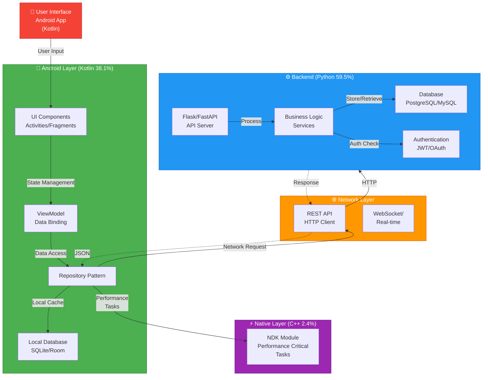
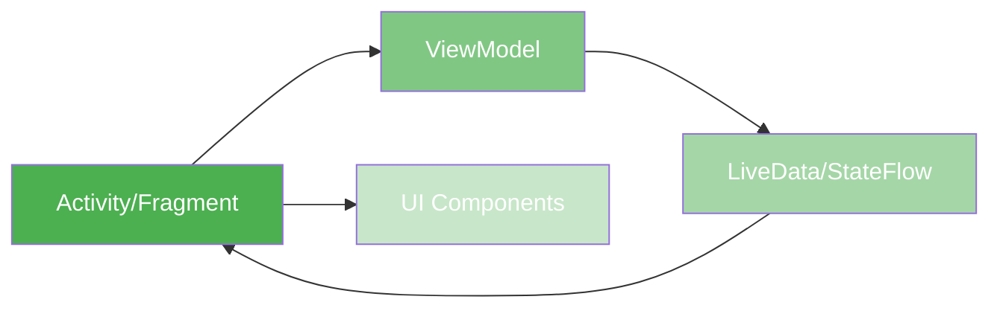
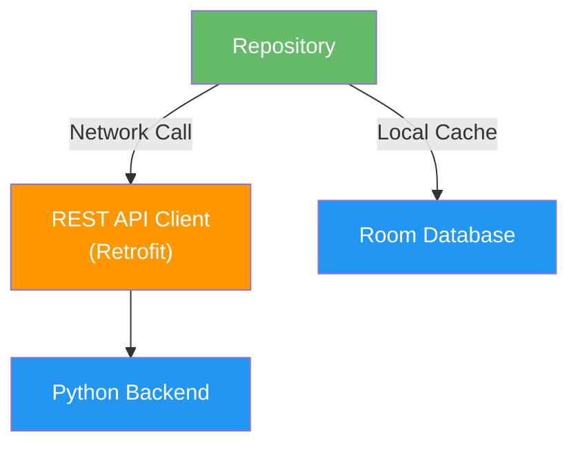
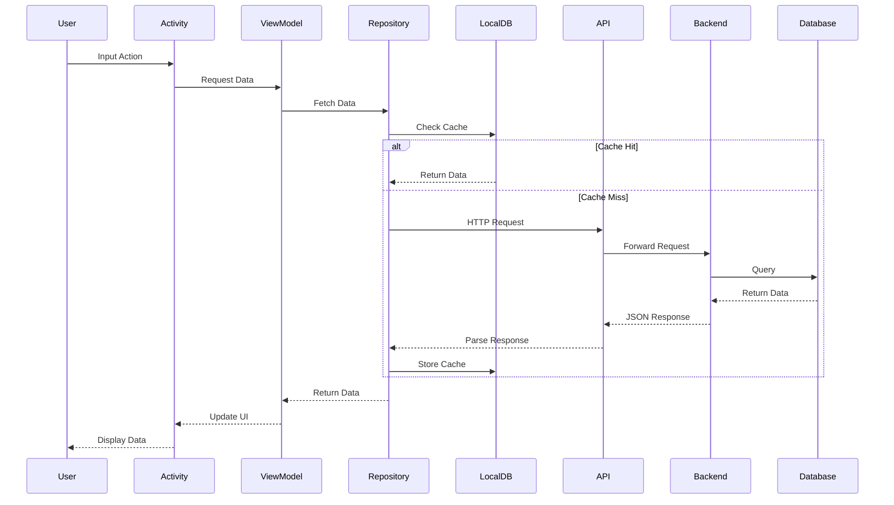

# Arsitektur Aplikasi Android

## Diagram Arsitektur Umum



## Layer Details

### 1. **Presentation Layer (UI - Kotlin)**
- **Activities & Fragments**: Komponen UI utama
- **ViewModel**: Manajemen state dan lifecycle
- **Data Binding**: Binding otomatis antara UI dan data
- **Adapters**: Untuk RecyclerView dan ListView



### 2. **Data Layer (Kotlin)**
- **Repository Pattern**: Abstraksi akses data
- **Local Database**: SQLite/Room untuk cache
- **Network Service**: HTTP client (Retrofit/OkHttp)



### 3. **Backend Layer (Python)**
- **Flask/FastAPI**: Web framework
- **Business Logic**: Service classes
- **Authentication**: JWT/OAuth implementation
- **Database**: Koneksi ke database

```mermaid
graph TB
    Request["HTTP Request<br/>from Android"]
    Router["API Router"]
    Auth["Authentication<br/>Middleware"]
    Controller["Controller/Handler"]
    Service["Business Logic<br/>Service"]
    Database[(("Database<br/>PostgreSQL"))]
    
    Request --> Router
    Router --> Auth
    Auth -->|Valid| Controller
    Controller --> Service
    Service --> Database
    Service -->|Response| Controller
    Controller -->|JSON| Request
    
    style Request fill:#FF9800,color:#fff
    style Auth fill:#F44336,color:#fff
    style Service fill:#2196F3,color:#fff
    style Database fill:#1565C0,color:#fff
```

### 4. **Native Layer (C++)**
- **JNI Binding**: Koneksi Java/Kotlin ke C++
- **Performance Critical**: Operasi berat/komputasi
- **NDK Module**: Optimisasi native


## Data Flow

### User Action Flow


## Component Details

### Folder Structure
```
AplikasiSkripsi/
├── android/                 # Android Project (Kotlin)
│   ├── app/
│   │   ├── src/
│   │   │   ├── main/
│   │   │   │   ├── java/
│   │   │   │   │   ├── activities/
│   │   │   │   │   ├── fragments/
│   │   │   │   │   ├── viewmodels/
│   │   │   │   │   ├── repositories/
│   │   │   │   │   ├── models/
│   │   │   │   │   ├── adapters/
│   │   │   │   │   ├── services/
│   │   │   │   │   └── utils/
│   │   │   │   ├── res/
│   │   │   │   │   ├── layout/
│   │   │   │   │   ├── values/
│   │   │   │   │   ├── drawable/
│   │   │   │   │   └── menu/
│   │   │   │   └── AndroidManifest.xml
│   │   │   └── test/
│   │   └── build.gradle
│   └── settings.gradle
├── python_backend/         # Python Backend (59.5%)
│   ├── app/
│   │   ├── __init__.py
│   │   ├── main.py
│   │   ├── models/
│   │   │   ├── user.py
│   │   │   ├── product.py
│   │   │   └── ...
│   │   ├── routes/
│   │   │   ├── auth.py
│   │   │   ├── api.py
│   │   │   └── ...
│   │   ├── services/
│   │   │   ├── user_service.py
│   │   │   ├── product_service.py
│   │   │   └── ...
│   │   ├── middleware/
│   │   │   ├── auth.py
│   │   │   └── ...
│   │   ├── utils/
│   │   │   └── helpers.py
│   │   └── config.py
│   ├── requirements.txt
│   └── .env
├── cpp_native/             # C++ Native Code (2.4%)
│   ├── src/
│   │   ├── jni_bridge.cpp
│   │   ├── algorithms.cpp
│   │   └── ...
│   ├── include/
│   │   └── ...
│   └── CMakeLists.txt
├── docs/
│   └── ARCHITECTURE.md
└── README.md
```

## Technology Stack

| Layer | Technology | Purpose |
|-------|-----------|---------|
| **Mobile** | Kotlin, Jetpack | Android development |
| **UI** | MaterialDesign, DataBinding | User interface |
| **Database** | Room, SQLite | Local storage |
| **Network** | Retrofit, OkHttp | HTTP communication |
| **Async** | Coroutines, LiveData | Async operations |
| **Backend** | Python, Flask/FastAPI | Server logic |
| **ORM** | SQLAlchemy | Python database ORM |
| **Database** | PostgreSQL/MySQL | Backend database |
| **Auth** | JWT, OAuth2 | Authentication |
| **Native** | C++, JNI, NDK | Performance tasks |

## Design Patterns

- **MVP/MVVM**: Model-View-ViewModel pattern
- **Repository Pattern**: Data access abstraction
- **Singleton**: Database dan API client
- **Observer**: LiveData dan StateFlow
- **Dependency Injection**: Hilt atau Dagger2
- **Factory**: Object creation
- **Builder**: Complex object construction

## Security Considerations

- ✅ JWT token untuk authentication
- ✅ HTTPS untuk semua komunikasi
- ✅ Encryption untuk sensitive data
- ✅ Input validation di frontend dan backend
- ✅ Database encryption (SQLCipher untuk lokal)
- ✅ Secure SharedPreferences untuk tokens
- ✅ ProGuard/R8 untuk obfuscation

## Performance Optimization

- 🚀 Caching strategy (local database)
- 🚀 Lazy loading untuk data besar
- 🚀 Image compression dan caching
- 🚀 Database indexing
- 🚀 C++ untuk operasi compute-intensive
- 🚀 Coroutines untuk non-blocking operations

---

Terakhir diperbarui: 2026-06-07
