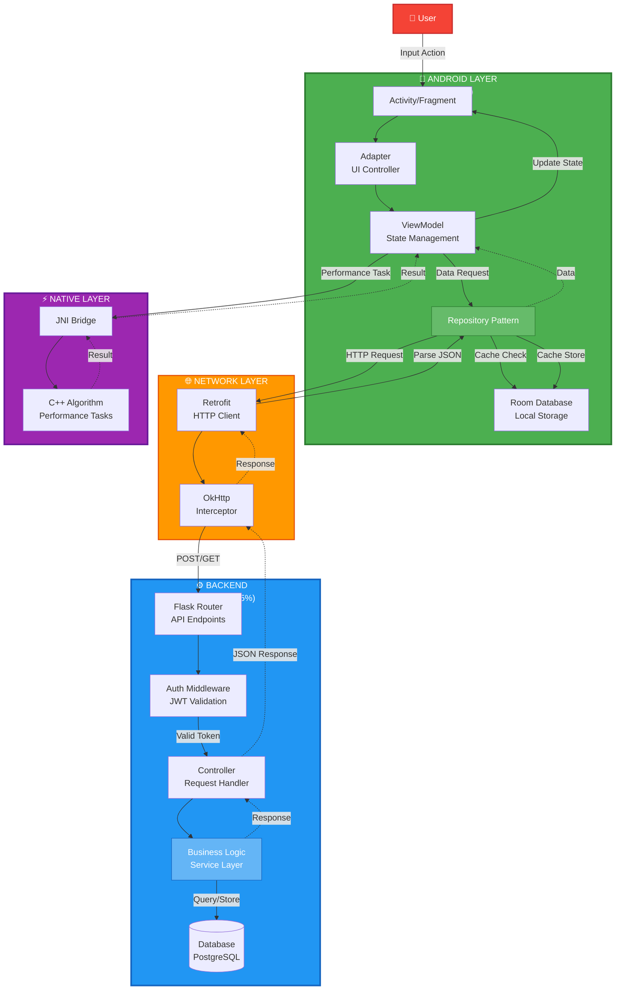
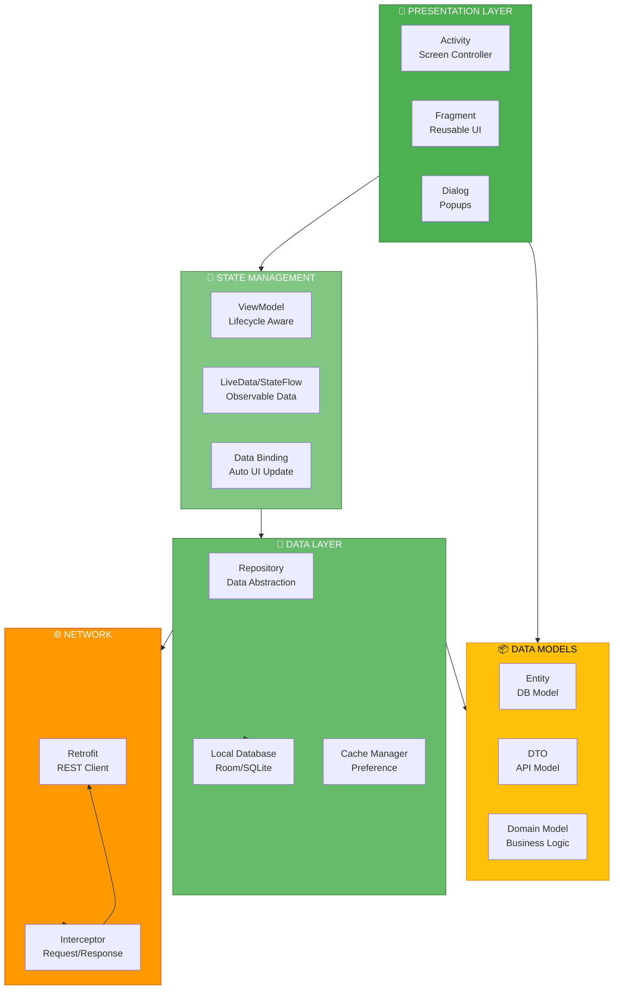
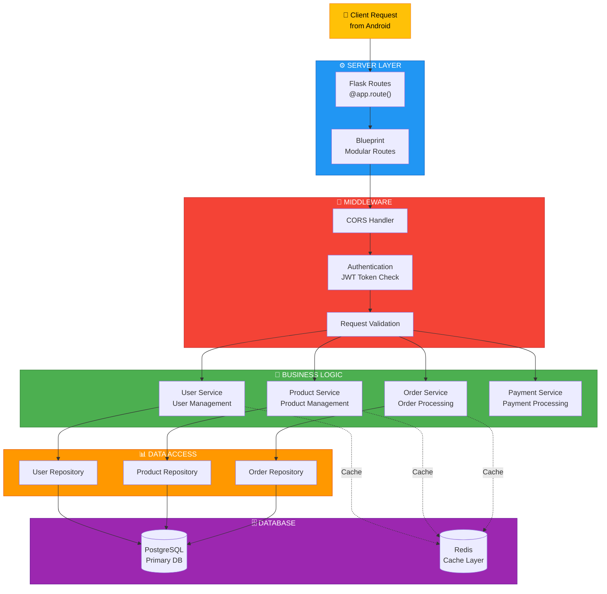
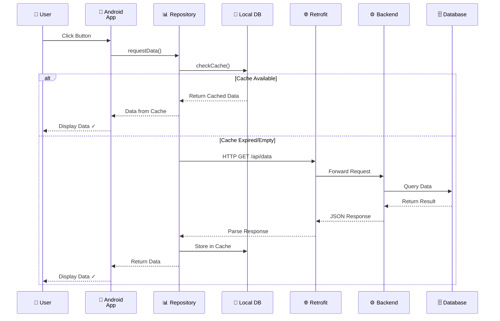
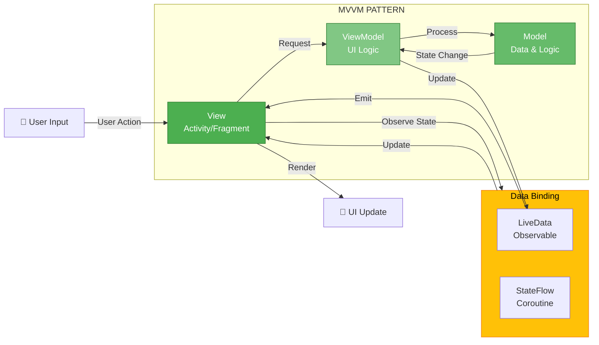
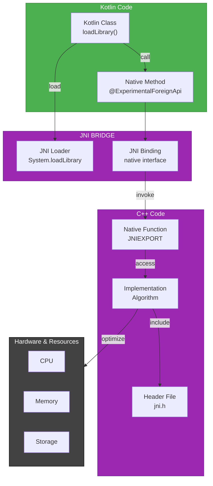
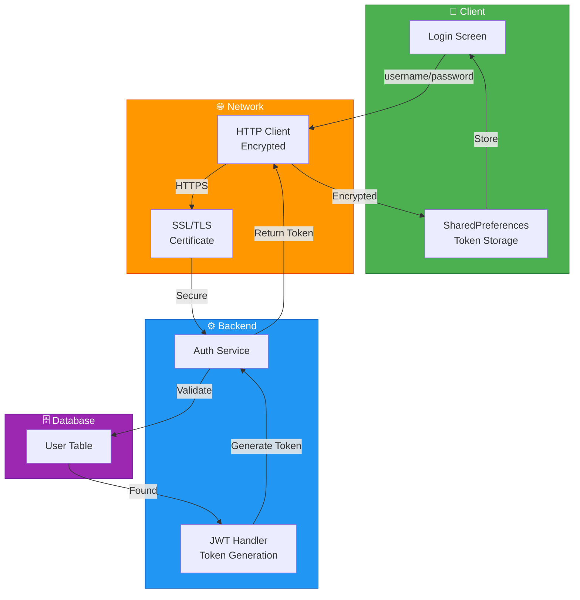
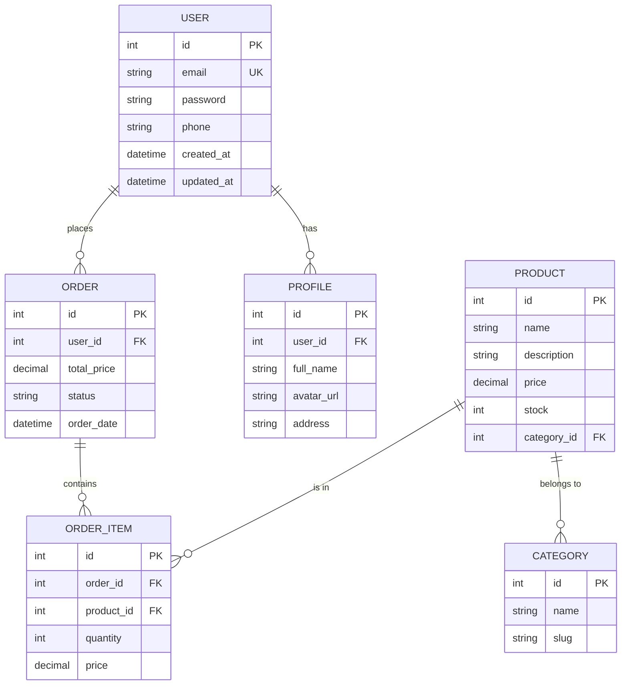
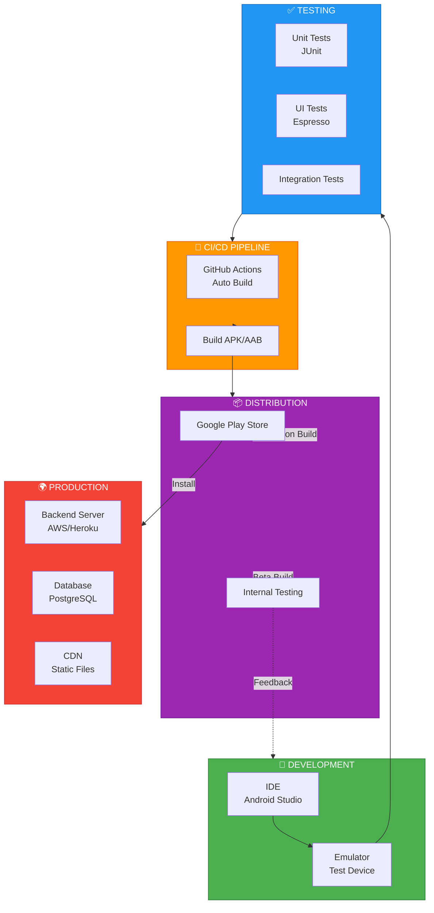
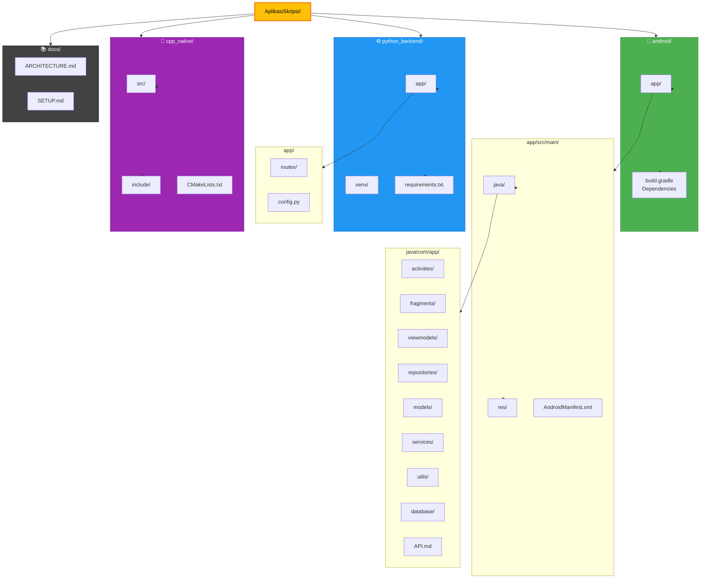

# Architecture Diagrams - Mermaid Code

Berikut adalah kumpulan diagram arsitektur dalam format Mermaid yang dapat diimpor langsung ke draw.io atau tools Mermaid lainnya.

---

## 1. Diagram Arsitektur Lengkap (Main Architecture)

---

## 2. Detailed Component Architecture

---

## 3. Backend Architecture (Python)

---

## 4. Data Flow - Complete Request Cycle

---

## 5. MVC/MVVM Pattern Flow

---

## 6. Native Code Integration (C++ with JNI)

---

## 7. Authentication & Security Flow

---

## 8. Database Schema Relationship

---

## 9. Deployment Architecture

---

## 10. Folder Structure as Architecture

---

## Cara Menggunakan Diagram di draw.io:

1. **Buka draw.io** → https://draw.io
2. **Klik File** → **New** → **Blank Diagram**
3. **Klik File** → **Import from** → **Paste URL or Code**
4. **Copy-paste salah satu kode Mermaid di atas**
5. **Klik Import** - Diagram akan otomatis terbentuk
6. **Edit dan customize** sesuai kebutuhan

---

**Tips:**
- ✅ Setiap diagram dapat di-zoom dan diedit
- ✅ Bisa diexport sebagai PNG, SVG, PDF
- ✅ Gunakan untuk dokumentasi atau presentasi
- ✅ Share dengan team untuk review

