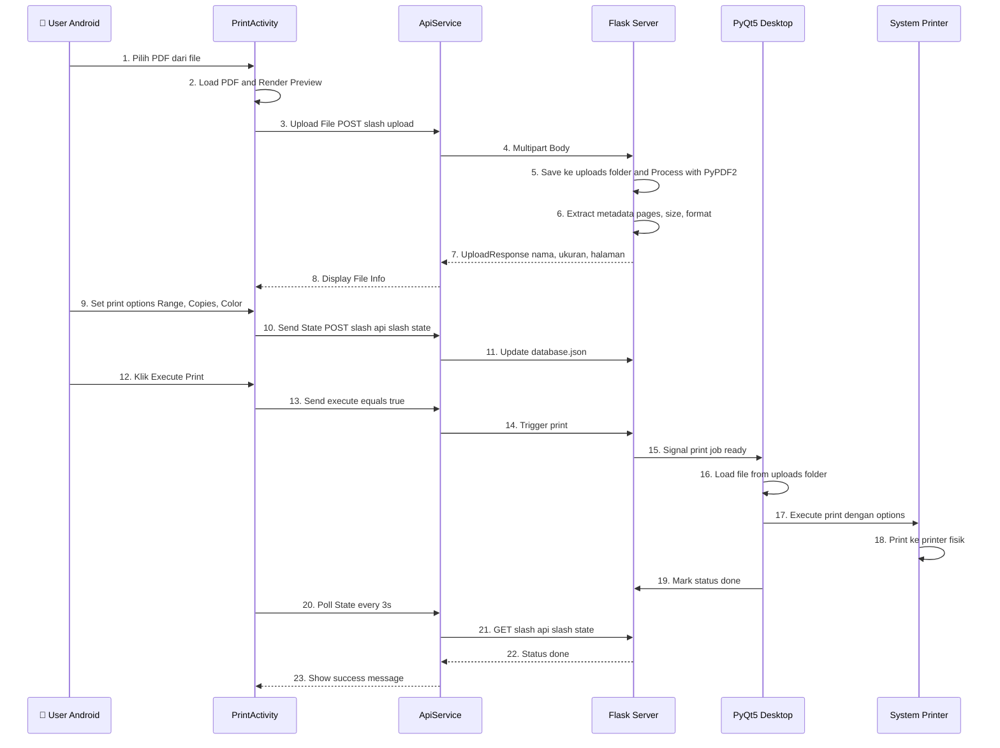
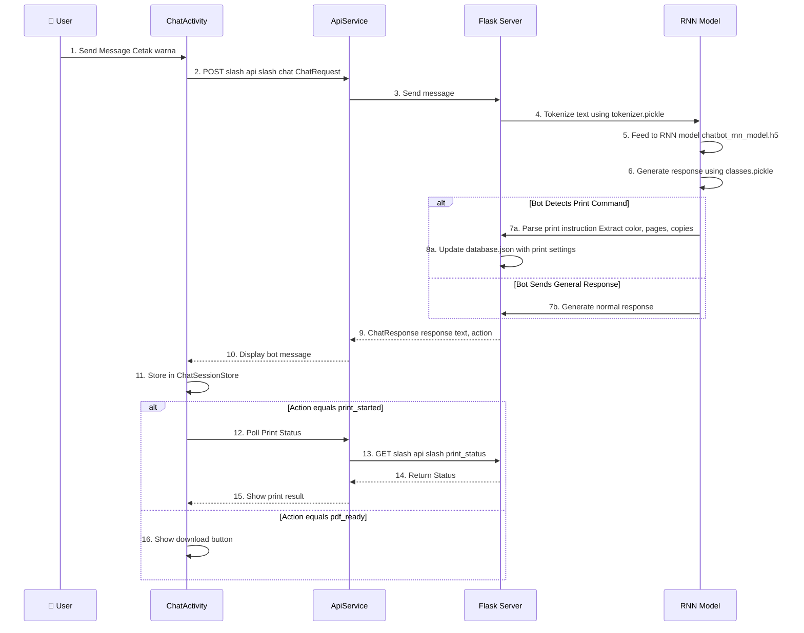

# 🏗️ Arsitektur Sistem: Print Server (Python) + Android App (Kotlin)

## 📊 Diagram Arsitektur End-to-End Lengkap

```mermaid
graph TB
    subgraph User["👤 USER INTERACTION"]
        AndroidUser["📱 User di Android<br/>(Print/Chat)"]
        PCOperator["🖥️ Operator PC<br/>(Desktop App Qt)"]
    end
    
    subgraph AndroidApp["📱 ANDROID APP<br/>(Kotlin 38.1%)"]
        subgraph PrintModule["PRINT MODULE"]
            MainActivity["MainActivity<br/>Menu Navigation"]
            PrintActivity["PrintActivity<br/>PDF Preview & Control"]
            PrintAdapter["Print Adapter<br/>UI Components"]
        end
        
        subgraph ChatModule["CHAT MODULE"]
            ChatActivity["ChatActivity<br/>Chat Interface"]
            ChatAdapter["ChatAdapter<br/>Message List"]
            ChatSessionStore["ChatSessionStore<br/>Session Memory"]
        end
        
        subgraph DataManagement["DATA MANAGEMENT"]
            ApiService["ApiService<br/>Retrofit HTTP Client"]
            UserProfileManager["UserProfileManager<br/>Local SharedPreferences"]
        end
        
        subgraph FileHandling["FILE HANDLING"]
            FilePicker["File Picker<br/>Uri to File"]
            PdfRenderer["PdfRenderer<br/>PDF Preview"]
        end
    end
    
    subgraph Network["🌐 NETWORK LAYER"]
        HTTPClient["HTTP REST API<br/>BaseURL: 0.0.0.0:5000"]
    end
    
    subgraph PythonBackend["⚙️ PYTHON BACKEND<br/>(Flask 59.5%)"]
        subgraph AppStructure["APP LAYER app.py"]
            FlaskApp["Flask Application<br/>at app.route"]
            FileUpload["slash upload<br/>PDF Upload Endpoint"]
            StateManagement["slash api slash state<br/>State Management"]
            PrinterAPI["slash api slash printers<br/>Printer Detection"]
        end
        
        subgraph ChatBot["🤖 CHATBOT ENGINE"]
            ChatBotModel["Chatbot RNN Model<br/>chatbot_rnn_model.h5"]
            Tokenizer["Tokenizer<br/>tokenizer.pickle"]
            Classes["Classes<br/>classes.pickle"]
            ChatEndpoint["slash api slash chat<br/>Message Processing"]
        end
        
        subgraph DataStorage["💾 DATA STORAGE"]
            DatabaseJson["database.json<br/>Local State Store<br/>files: list<br/>print_jobs: list"]
            UploadsDir["uploads folder<br/>Received Files"]
            DownloadsDir["downloads folder<br/>Generated Files"]
        end
        
        subgraph FileProcessing["📄 FILE PROCESSING"]
            PyPDF2["PyPDF2<br/>PDF Analysis"]
            PythonDocx["python-docx<br/>DOCX Convert"]
            PyMuPDF["PyMuPDF<br/>PDF Metadata"]
        end
        
        subgraph DesktopQT["🖥️ DESKTOP APP<br/>PyQt5 GUI"]
            QtWindow["Desktop App Qt<br/>desktop_app_qt.py"]
            Printer["System Printer API<br/>pywin32"]
            PrintExecution["Print Queue<br/>Execution Engine"]
        end
    end
    
    subgraph Training["🎓 MODEL TRAINING"]
        TrainChatbot["train_chatbot.py<br/>RNN Model Training"]
        DatasetChatbot["dataset_chatbot.json<br/>Training Data"]
    end
    
    AndroidUser -->|Open App| MainActivity
    MainActivity -->|Select Print| PrintActivity
    AndroidUser -->|Pick PDF| FilePicker
    FilePicker -->|Load PDF| PdfRenderer
    PdfRenderer -->|Display Preview| PrintActivity
    AndroidUser -->|Configure<br/>Range, Copies, Color| PrintActivity
    PrintActivity -->|Upload PDF| ApiService
    
    ApiService -->|POST slash upload| HTTPClient
    HTTPClient -->|HTTP Request| FileUpload
    FileUpload -->|Save File| UploadsDir
    FileUpload -->|Process PDF| FileProcessing
    FileProcessing -->|Extract Metadata<br/>Pages, Size, Format| DatabaseJson
    FileUpload -->|JSON Response| HTTPClient
    HTTPClient -->|UploadResponse| ApiService
    PrintActivity -->|Display File Info<br/>Name, Size, Pages| PrintActivity
    
    PrintActivity -->|Send State<br/>Range, Copies, Color| ApiService
    ApiService -->|POST slash api slash state| HTTPClient
    HTTPClient -->|Update State| StateManagement
    StateManagement -->|Update Remote State| DatabaseJson
    
    PrintActivity -->|Load Printers| ApiService
    ApiService -->|GET slash api slash printers| HTTPClient
    HTTPClient -->|Query| PrinterAPI
    PrinterAPI -->|Detect System Printers| Printer
    Printer -->|Return Available Printers| PrinterAPI
    PrinterAPI -->|JSON Response| HTTPClient
    HTTPClient -->|PrinterResponse| ApiService
    PrintActivity -->|Display Printer List| PrintActivity
    
    AndroidUser -->|Click Execute Print| PrintActivity
    PrintActivity -->|Set execute true| ApiService
    ApiService -->|POST slash api slash state| HTTPClient
    HTTPClient -->|Trigger print| PrintExecution
    PrintExecution -->|Load file from uploads| UploadsDir
    PrintExecution -->|Execute Print Job| Printer
    PrintExecution -->|Mark as Done| DatabaseJson
    
    PrintActivity -->|Poll State every 3s| ApiService
    ApiService -->|GET slash api slash state| HTTPClient
    HTTPClient -->|Check Status| DatabaseJson
    DatabaseJson -->|Return State| HTTPClient
    HTTPClient -->|RemoteStateResponse| ApiService
    ApiService -->|Update UI| PrintActivity
    
    AndroidUser -->|Open Chat| ChatActivity
    ChatActivity -->|Register User| ApiService
    ApiService -->|POST slash register| HTTPClient
    HTTPClient -->|Store User ID| DatabaseJson
    ChatActivity -->|Show Greeting| ChatSessionStore
    AndroidUser -->|Send Message| ChatActivity
    ChatActivity -->|Add to List| ChatSessionStore
    
    ChatActivity -->|POST slash api slash chat| ApiService
    ApiService -->|Send Message| HTTPClient
    HTTPClient -->|Process Message| ChatEndpoint
    ChatEndpoint -->|Tokenize Input| Tokenizer
    Tokenizer -->|Feed to RNN| ChatBotModel
    ChatBotModel -->|Generate Response| Classes
    ChatEndpoint -->|ChatResponse| HTTPClient
    HTTPClient -->|Bot Reply| ApiService
    ApiService -->|Show Bot Message| ChatActivity
    ChatActivity -->|Store Message| ChatSessionStore
    
    AndroidUser -->|Attach PDF| ChatActivity
    FilePicker -->|Pick PDF| ChatActivity
    ChatActivity -->|Upload File| ApiService
    ApiService -->|POST slash upload| HTTPClient
    HTTPClient -->|Save File| UploadsDir
    FileProcessing -->|Process| FileProcessing
    FileUpload -->|File Metadata| DatabaseJson
    FileUpload -->|JSON Response| ApiService
    ChatActivity -->|Show File Details| ChatActivity
    
    AndroidUser -->|Type Print Instructions| ChatActivity
    ChatActivity -->|Send Instruction| ChatEndpoint
    ChatEndpoint -->|Parse Instruction| ChatBotModel
    ChatBotModel -->|Update Print State| DatabaseJson
    ChatBotModel -->|Trigger Print| PrintExecution
    PrintExecution -->|Execute Print| Printer
    PrintExecution -->|Mark Status| DatabaseJson
    ChatActivity -->|Poll Print Status| ApiService
    ApiService -->|GET slash api slash print_status| HTTPClient
    HTTPClient -->|Check Status| DatabaseJson
    DatabaseJson -->|Return Status done| HTTPClient
    ApiService -->|Show Success Message| ChatActivity
    
    PCOperator -->|Run desktop_app_qt.py| QtWindow
    QtWindow -->|Connect to Server| FlaskApp
    QtWindow -->|Load Recent Files| DatabaseJson
    QtWindow -->|Select File and Options| QtWindow
    QtWindow -->|Click Print| PrintExecution
    PrintExecution -->|Execute Print| Printer
    
    style User fill:#FFC107,stroke:#F57F17,stroke-width:2px,color:#000
    style AndroidApp fill:#4CAF50,stroke:#2E7D32,stroke-width:3px,color:#fff
    style PrintModule fill:#66BB6A,color:#fff
    style ChatModule fill:#66BB6A,color:#fff
    style DataManagement fill:#81C784,color:#fff
    style FileHandling fill:#81C784,color:#fff
    style Network fill:#FF9800,stroke:#E65100,stroke-width:2px,color:#fff
    style PythonBackend fill:#2196F3,stroke:#1565C0,stroke-width:3px,color:#fff
    style AppStructure fill:#64B5F6,color:#fff
    style ChatBot fill:#42A5F5,color:#fff
    style DataStorage fill:#1E88E5,color:#fff
    style FileProcessing fill:#1565C0,color:#fff
    style DesktopQT fill:#1565C0,color:#fff
    style Training fill:#FFC107,stroke:#F57F17,color:#000
```



---

## 🔄 Proses Lengkap: Print Flow



---

## 🤖 Chat Bot Flow



---

## 📁 Struktur File Sistem

```mermaid
graph TD
    Root["AplikasiSkripsi slash"]
    
    subgraph PrintServer["print_server slash"]
        AppPy["app.py<br/>Flask Application<br/>Routes and APIs"]
        DesktopQt["desktop_app_qt.py<br/>PyQt5 GUI"]
        TrainBot["train_chatbot.py<br/>Model Training"]
        RunApp["run_app.py<br/>Multi-threading<br/>Flask and GUI"]
        
        DatabaseJson["database.json<br/>State Storage<br/>files list<br/>print_jobs list"]
        DatasetJson["dataset_chatbot.json<br/>Training Data"]
        
        Models["Models"]
        ChatbotH5["chatbot_rnn_model.h5<br/>Trained RNN Model"]
        Tokenizer["tokenizer.pickle<br/>Word Tokenizer"]
        Classes["classes.pickle<br/>Output Classes"]
        
        Uploads["uploads slash<br/>User Uploaded PDFs"]
        Downloads["downloads slash<br/>Generated Files"]
        
        Requirements["requirements.txt<br/>flask<br/>PyPDF2<br/>python-docx<br/>pywin32<br/>PyMuPDF<br/>PyQt5"]
    end
    
    subgraph AndroidApp["ProjekAndroid slash"]
        PrintUploader["PrintUploader slash"]
        
        subgraph AndroidSrc["app slash src slash main slash"]
            Manifest["AndroidManifest.xml"]
            Java["java slash com slash example slash printuploader slash"]
            Res["res slash"]
        end
        
        subgraph KotlinClasses["Kotlin Classes"]
            MainActivity["MainActivity.kt"]
            PrintActivity["PrintActivity.kt<br/>PDF Preview and Control"]
            PrintAdapter["PrintAdapter.kt"]
            
            ChatActivity["ChatActivity.kt<br/>Chat Interface"]
            ChatAdapter["ChatAdapter.kt"]
            ChatSessionStore["ChatSessionStore.kt"]
            
            ApiService["ApiService.kt<br/>Retrofit Interface"]
            UserProfileManager["UserProfileManager.kt"]
            UploadResponse["UploadResponse.kt"]
        end
        
        BuildGradle["build.gradle<br/>Dependencies<br/>Retrofit<br/>OkHttp<br/>RecyclerView"]
    end
    
    Root --> PrintServer
    Root --> AndroidApp
    
    PrintServer --> AppPy
    PrintServer --> DesktopQt
    PrintServer --> TrainBot
    PrintServer --> RunApp
    PrintServer --> DatabaseJson
    PrintServer --> DatasetJson
    PrintServer --> Models
    PrintServer --> Uploads
    PrintServer --> Downloads
    PrintServer --> Requirements
    
    Models --> ChatbotH5
    Models --> Tokenizer
    Models --> Classes
    
    AndroidApp --> PrintUploader
    PrintUploader --> AndroidSrc
    PrintUploader --> BuildGradle
    AndroidSrc --> Manifest
    AndroidSrc --> Java
    AndroidSrc --> Res
    
    Java --> KotlinClasses
    KotlinClasses --> MainActivity
    KotlinClasses --> PrintActivity
    KotlinClasses --> ChatActivity
    KotlinClasses --> ApiService
    
    style Root fill:#FFC107,stroke:#F57F17,stroke-width:3px,color:#000
    style PrintServer fill:#2196F3,stroke:#1565C0,stroke-width:2px,color:#fff
    style AndroidApp fill:#4CAF50,stroke:#2E7D32,stroke-width:2px,color:#fff
    style Models fill:#9C27B0,stroke:#6A1B9A,color:#fff
    style KotlinClasses fill:#66BB6A,color:#fff
```



---

## 🔑 Key API Endpoints (Flask)

| Endpoint | Method | Android Module | Purpose |
|----------|--------|----------------|---------|
| `/upload` | POST | PrintActivity, ChatActivity | Upload PDF file |
| `/api/state` | GET/POST | PrintActivity | Get/Set print state |
| `/api/printers` | GET | PrintActivity | Get list of available printers |
| `/api/chat` | POST | ChatActivity | Send message to RNN bot |
| `/api/print_status` | GET | ChatActivity | Get current print status |
| `/api/check_server` | GET | ChatActivity | Health check |
| `/register` | POST | ChatActivity | Register user |

---

## 💾 Data Flow: database.json

```json
{
  "files": [
    {
      "nama_file": "dokumen.pdf",
      "ukuran_kb": 250,
      "jumlah_halaman": 5,
      "ukuran_kertas": "A4",
      "jenis_file": "pdf",
      "upload_time": "2024-01-01T10:00:00"
    }
  ],
  "print_jobs": [
    {
      "nama_file": "dokumen.pdf",
      "printer_name": "HP Printer",
      "pages": "1-3",
      "copies": 2,
      "color_mode": "Color",
      "status": "done",
      "execution_time": "2024-01-01T10:05:00"
    }
  ]
}
```

---

## 🎯 Fitur Utama Sistem

### **Android Print Module**
- ✅ Pilih and preview PDF dari device
- ✅ Kontrol page range (1-3, 2,4,6, dll)
- ✅ Pengaturan jumlah copy
- ✅ Pilih mode warna (Grayscale slash Color)
- ✅ Deteksi printer dari PC
- ✅ Real-time sync state dengan desktop
- ✅ Polling status (setiap 3 detik)

### **Android Chat Module**
- ✅ Chat dengan RNN Chatbot
- ✅ Kirim PDF ke bot untuk analisis
- ✅ Bot memberikan instruksi cetak natural language
- ✅ Bot execute print berdasarkan instruksi
- ✅ Notifikasi masuk chat
- ✅ Download file hasil bot
- ✅ Health check server (setiap 2 detik)

### **Python Backend (Flask)**
- ✅ Multi-threading Flask and PyQt5 GUI
- ✅ PDF upload and metadata extraction
- ✅ RNN chatbot inference
- ✅ Print queue management
- ✅ JSON-based state storage
- ✅ System printer detection (pywin32)

### **Desktop App (PyQt5)**
- ✅ Real-time file preview
- ✅ Execute print jobs
- ✅ Operator manual control
- ✅ Print queue visualization

---

## ⚡ Teknologi Stack

| Component | Technology | Purpose |
|-----------|-----------|---------|
| Android Frontend | Kotlin, Retrofit, OkHttp | Mobile UI and HTTP requests |
| Desktop Frontend | PyQt5 | GUI for operator |
| Web Server | Flask | REST API and request handling |
| PDF Processing | PyPDF2, PyMuPDF, python-docx | File analysis and conversion |
| AI Model | TensorFlow slash Keras RNN | Chatbot inference |
| System Integration | pywin32 | Printer detection and control |
| Database | JSON file | State persistence |
| HTTP Client | Retrofit (Android), Requests (Python) | API communication |

---

## 🔄 Data Synchronization Strategy

1. **Print State Sync**: Android mengirim state setiap kali ada perubahan → Server update database.json
2. **File Metadata**: Saat upload, server parse PDF dan update database.json
3. **Print Status**: Android poll setiap 3 detik untuk mendapat status terbaru
4. **Chat History**: Disimpan di ChatSessionStore (in-memory) di Android
5. **User Profile**: Tersimpan di SharedPreferences Android

---

**Diagram ini mencakup semua aspek dari kedua aplikasi Anda secara detail!** 🎉

Terakhir diperbarui: 2026-06-07
