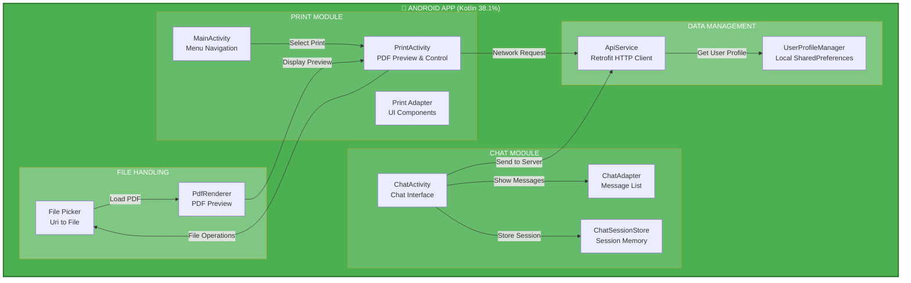
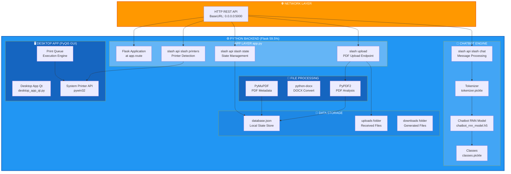
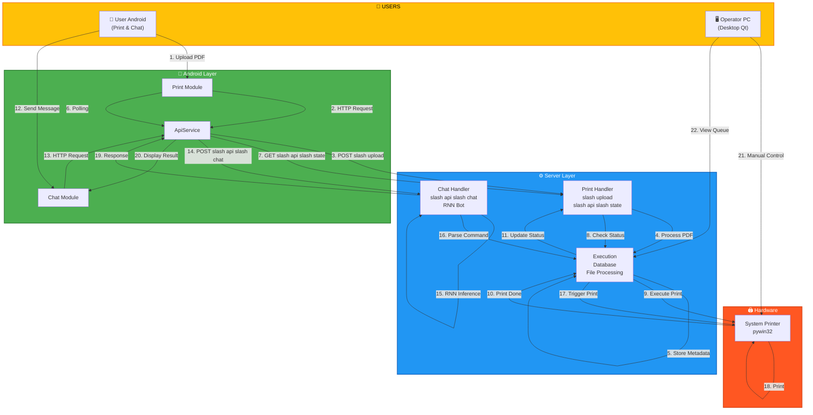
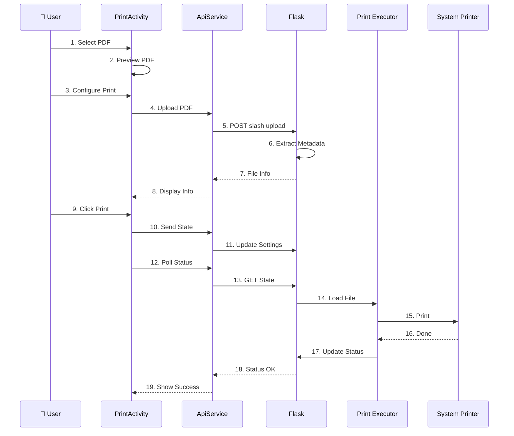
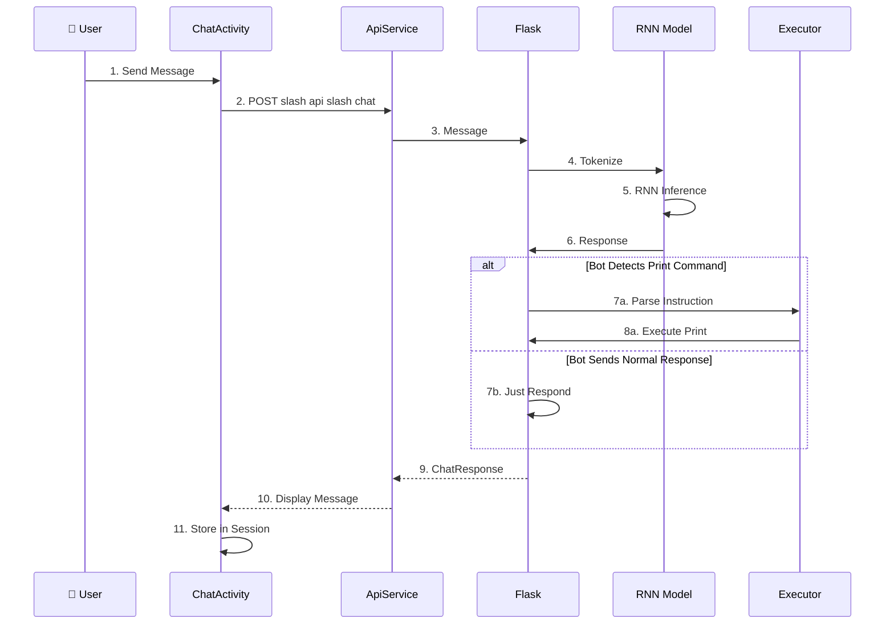
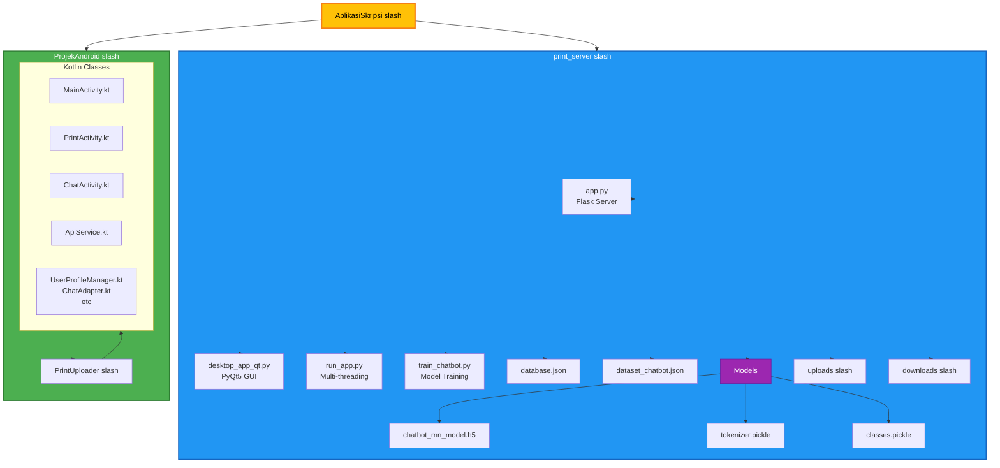

# 🏗️ Arsitektur Sistem: Print Server (Python) + Android App (Kotlin)

## 📊 Diagram 1: Android App Architecture



---

## 🌐 Diagram 2: Backend Architecture (Python Flask)



---

## 🔗 Diagram 3: Complete System Integration Flow



---

## 🔄 Print Flow: Sequence Diagram



---

## 🤖 Chat Bot Flow: Sequence Diagram



---

## 📁 Struktur File Sistem



---

## 🔑 API Endpoints Reference

| Endpoint | Method | Purpose | From |
|----------|--------|---------|------|
| `/upload` | POST | Upload PDF file | PrintActivity, ChatActivity |
| `/api/state` | GET/POST | Get/Set print state | PrintActivity |
| `/api/printers` | GET | Get available printers | PrintActivity |
| `/api/chat` | POST | Send message to bot | ChatActivity |
| `/api/print_status` | GET | Get print status | ChatActivity |
| `/api/check_server` | GET | Health check | ChatActivity |
| `/register` | POST | Register user | ChatActivity |

---

## 💾 database.json Structure

```json
{
  "files": [
    {
      "nama_file": "dokumen.pdf",
      "ukuran_kb": 250,
      "jumlah_halaman": 5,
      "upload_time": "2024-01-01T10:00:00"
    }
  ],
  "print_jobs": [
    {
      "nama_file": "dokumen.pdf",
      "printer_name": "HP Printer",
      "pages": "1-3",
      "copies": 2,
      "color_mode": "Color",
      "status": "done",
      "execution_time": "2024-01-01T10:05:00"
    }
  ]
}
```

---

## ⚡ Technology Stack

| Component | Technology | Purpose |
|-----------|-----------|---------|
| Android Frontend | Kotlin, Retrofit, OkHttp | Mobile UI and HTTP |
| Desktop Frontend | PyQt5 | GUI for operator |
| Web Server | Flask | REST API |
| PDF Processing | PyPDF2, PyMuPDF, python-docx | File analysis |
| AI Model | TensorFlow Keras RNN | Chatbot |
| System Integration | pywin32 | Printer control |
| Database | JSON file | State persistence |

---

## 🎯 Main Features

### Android Print Module
- Select and preview PDF
- Control page range
- Set number of copies
- Choose color mode (Grayscale/Color)
- Detect printer from PC
- Real-time state sync
- Status polling every 3 seconds

### Android Chat Module
- Chat with RNN Chatbot
- Send PDF for analysis
- Bot gives natural language print instructions
- Bot executes print based on instructions
- Chat notifications
- Download bot results
- Server health check every 2 seconds

### Python Backend (Flask)
- Multi-threading Flask and PyQt5
- PDF upload and metadata extraction
- RNN chatbot inference
- Print queue management
- JSON state storage
- System printer detection

### Desktop App (PyQt5)
- Real-time file preview
- Execute print jobs
- Operator manual control
- Print queue visualization

---

**Updated: 2026-06-07** ✨
