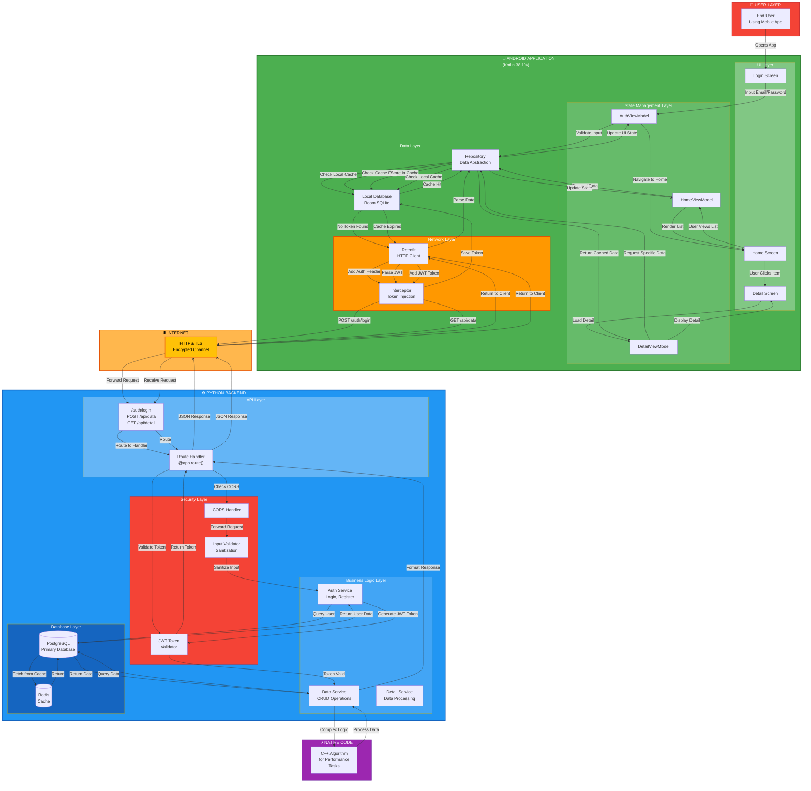
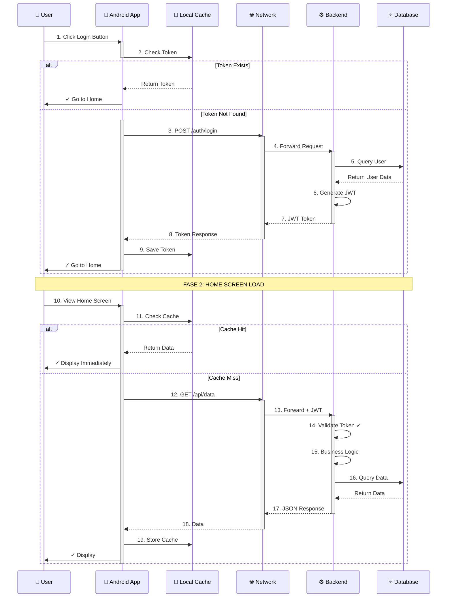

# Sistem Arsitektur: Android (Kotlin) + Python Backend

## 📊 Complete End-to-End System Architecture



---

## 🔄 Alur Proses Lengkap: Login → Home → Detail

### **FASE 1: INITIALIZATION**
```
User Opens App
    ↓
Check Local Token
    ├─ Token Valid → Go to Home Screen
    └─ Token Expired/None → Go to Login Screen
```

### **FASE 2: AUTHENTICATION (Login)**
```
1. User Input Email & Password
   ↓
2. AuthViewModel Validate Input
   ↓
3. Repository Check Local Cache (Token)
   ↓
4. Retrofit POST /auth/login dengan credentials
   ↓
5. Interceptor Tambah Headers (HTTPS)
   ↓
6. Backend Auth Service:
   - Validate Email/Password
   - Query Database User
   - Check Password Hash
   ↓
7. Generate JWT Token
   ↓
8. Return Token ke Android
   ↓
9. Save Token di SharedPreferences
   ↓
10. Navigate to Home Screen
```

### **FASE 3: DATA FETCHING (Home Screen)**
```
1. User Navigate ke Home
   ↓
2. HomeViewModel Request Data
   ↓
3. Repository Check Local Cache
   ├─ Hit → Return Cached Data (Fast) → Display
   └─ Miss → Continue to Network Request
   ↓
4. Retrofit GET /api/data dengan JWT Token
   ↓
5. Backend Service:
   - JWT Token Validation ✓
   - Input Sanitization ✓
   - Business Logic Processing
   - Call C++ Module for Heavy Computation
   - Query PostgreSQL Database
   - Check Redis Cache Layer
   ↓
6. Format Response (JSON)
   ↓
7. Return ke Android
   ↓
8. Repository Store di Local Database
   ↓
9. ViewModel Update State (LiveData)
   ↓
10. RecyclerView Render List UI
```

### **FASE 4: DETAIL VIEW (Detail Screen)**
```
1. User Click Item di List
   ↓
2. DetailViewModel Request Data
   ↓
3. Repository Check Local Cache
   ├─ Available → Return Immediately
   └─ Not Available → Network Request
   ↓
4. Display Detail Information
   ↓
5. Optional: Real-time Updates via WebSocket
```

---

## 📈 Request Flow Diagram



---

## 🔐 Security Implementation

```
User Input (Android)
    ↓
Frontend Validation
    ↓
Encrypt with HTTPS/TLS
    ↓
Backend Receives
    ↓
CORS Validation ✓
    ↓
Input Sanitization & Validation ✓
    ↓
JWT Token Verification ✓
    ↓
Rate Limiting ✓
    ↓
SQL Injection Prevention (ORM) ✓
    ↓
Database Operation
    ↓
Encrypt Response
    ↓
Send to Android
    ↓
Decrypt & Store Securely
```

---

## 📊 Key Components Communication

| Android Component | ↔️ | Backend Component | Purpose |
|------------------|-----|------------------|---------|
| LoginScreen | POST | /auth/login | Authentication |
| HomeScreen | GET | /api/data | Fetch List Data |
| DetailScreen | GET | /api/detail/{id} | Fetch Detail Data |
| Repository | - | Services | Business Logic |
| LocalDatabase | - | PostgreSQL | Data Persistence |
| ViewModel | - | - | State Management |
| - | - | JWTValidator | Security Check |
| - | - | CPPModule | Performance Tasks |

---

## 🎯 Performance Optimizations

1. **Caching Strategy**
   - Local Cache untuk data yang jarang berubah
   - Redis Cache di backend untuk query intensive
   - LRU Cache untuk memory optimization

2. **Network Optimization**
   - HTTP/2 Multiplexing
   - GZIP Compression
   - Request Batching

3. **Database Optimization**
   - Indexed Queries
   - Connection Pooling
   - Lazy Loading

4. **Native Code**
   - C++ untuk komputasi heavy
   - JNI Bridge untuk integrasi

---

## ✅ Error Handling & Retry Strategy

```
Request Sent
    ↓
Check Response Status
    ├─ 200 OK → Success ✓
    ├─ 401 Unauthorized → Refresh Token → Retry
    ├─ 5xx Server Error → Retry (Exponential Backoff)
    ├─ Network Error → Store Queue → Retry Later
    └─ Invalid Input → Show Error to User
```

---

Terakhir diperbarui: 2026-06-07
Diagram format: Mermaid (Compatible dengan draw.io)
```
